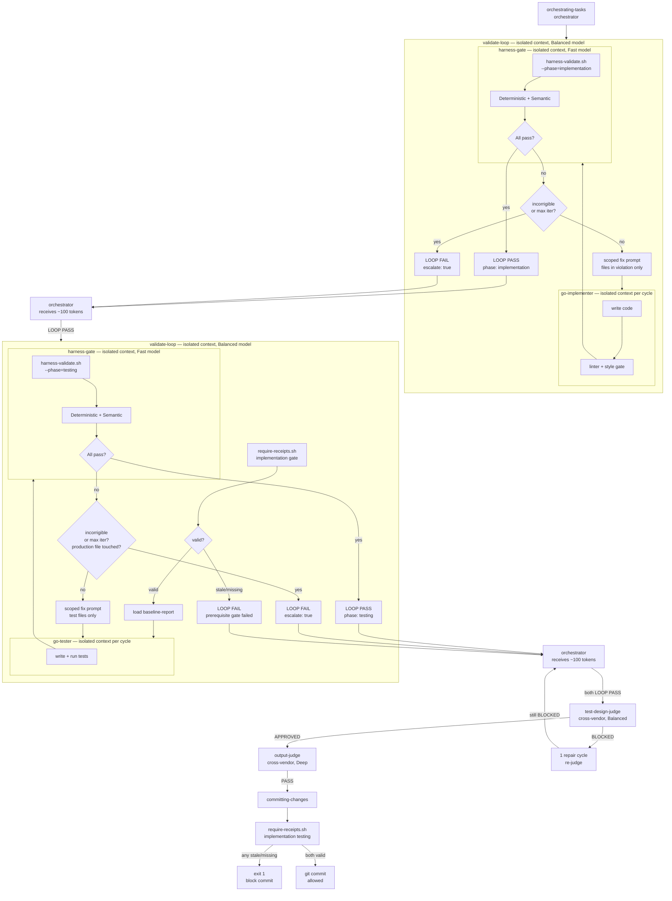
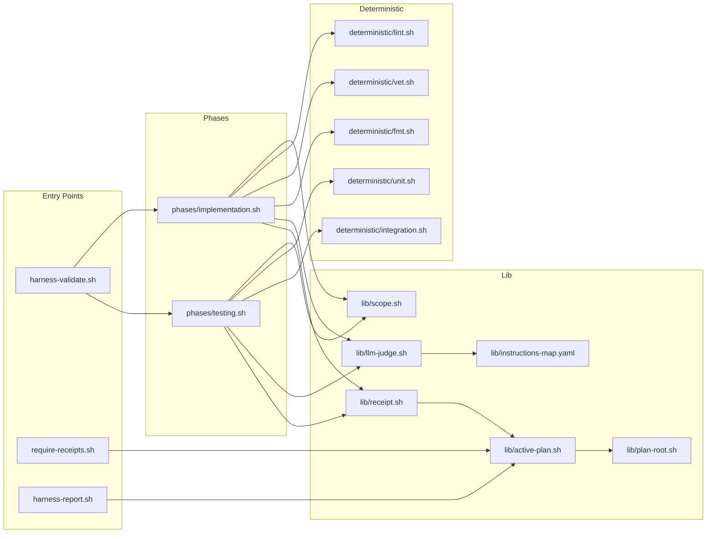

# Harness Architecture

## Enforcement Flow



> **Key design principle**: `harness-gate` (Fast model, isolated) is dispatched by `validate-loop` at each iteration cycle, not by the orchestrator directly. The `validate-loop` agent (Balanced model, isolated) owns the repair loop for one phase — it runs code-agent + harness-gate cycles, detects incorrigible violations, and returns only a compact `LOOP PASS` or `LOOP FAIL` block (~100 tokens) to the orchestrator. All violation details, fix prompts, and repair output are discarded when validate-loop exits. The orchestrator never calls `harness-validate.sh` directly and never sees intermediate repair state.

## Component Map



## Receipt Schema

```json
{
  "phase": "implementation",
  "head_sha": "abc123...",
  "diff_hash": "sha256 of git diff HEAD",
  "scope": ["path/to/changed/package/"],
  "timestamp": "2026-05-26T14:00:00Z",
  "deterministic": [
    {"check": "lint",   "result": "pass"},
    {"check": "vet",    "result": "pass"},
    {"check": "fmt",    "result": "pass"}
  ],
  "semantic": [
    {"instruction": "go-style.md",   "result": "pass", "violations": []},
    {"instruction": "writing-modern-go/SKILL.md",  "result": "pass", "violations": []},
    {"instruction": "error-handling.md", "result": "fail",
     "violations": [{"file": "foo.go", "line": 42, "rule": "...", "severity": "high"}]}
  ],
  "overall": "fail"
}
```
