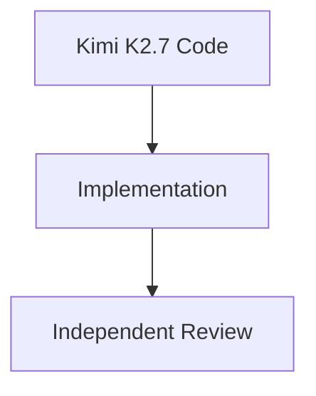
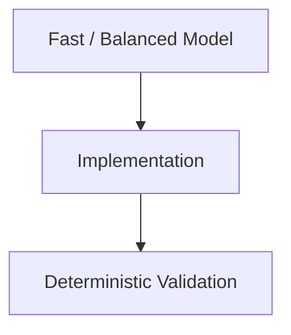
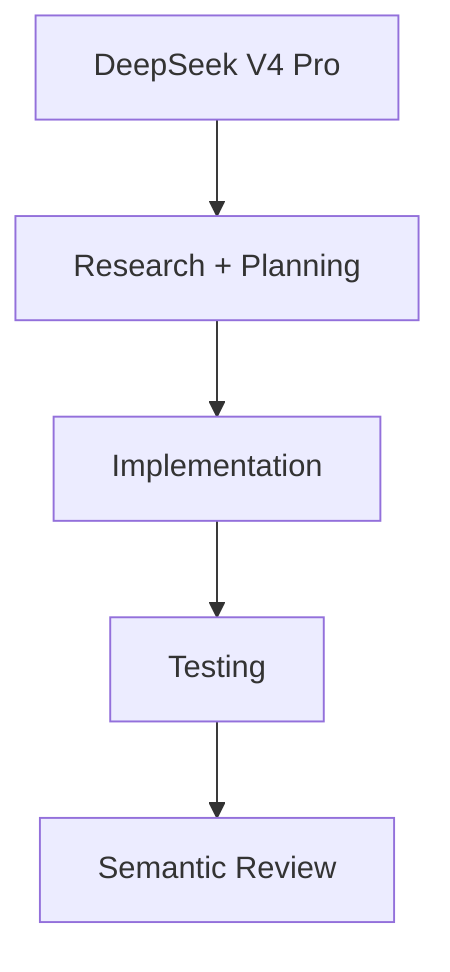
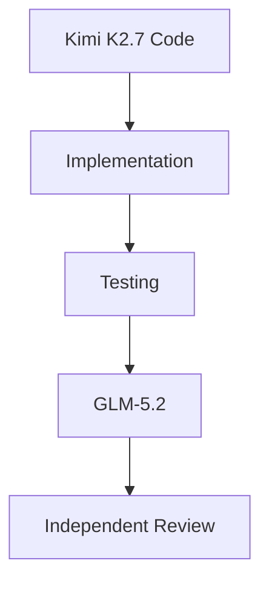
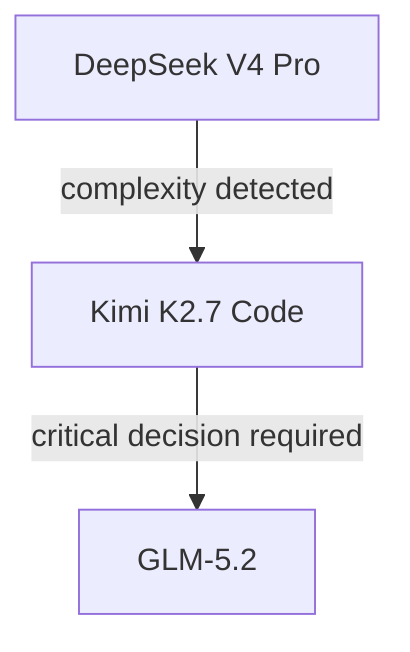
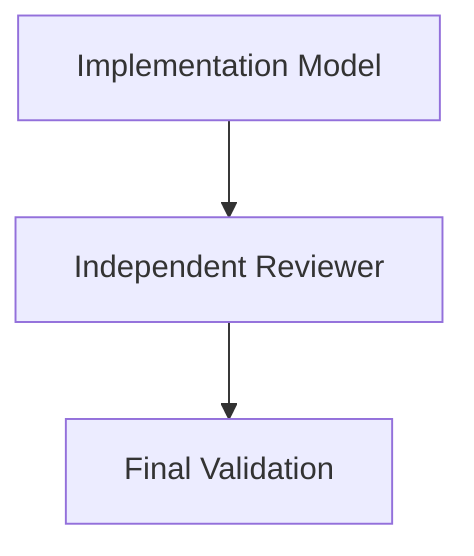
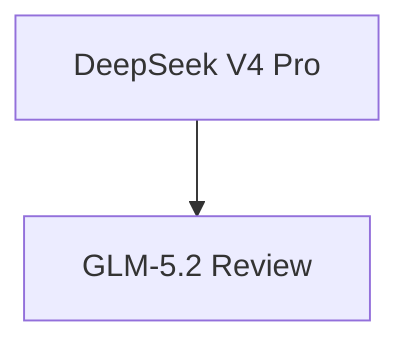
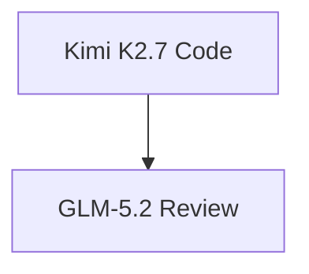

# AI Model Routing Strategy

## Purpose

This document defines the model selection strategy for AI-assisted software engineering workflows.

The goal is to maximize:

- engineering quality;
- reasoning capability;
- cost efficiency;
- context utilization;
- long-term provider sustainability.

The core principle:

> Use the cheapest model capable of safely completing the task.

More capable models should be used as escalation paths, architecture reviewers, and problem solvers, not as the default for every operation.

---

# General Routing Strategy

Model selection should be based on:

- task complexity;
- risk level;
- uncertainty;
- architectural impact;
- required validation depth;
- context size.

Model selection should **not** depend only on the programming language.

This strategy applies to:

- Go;
- TypeScript;
- JavaScript;
- Python;
- Java;
- Kotlin;
- Rust;
- infrastructure code;
- data engineering;
- other software ecosystems.

---

# Default Model

## DeepSeek V4 Pro

Primary engineering model.

Recommended for most daily development tasks.

Use for:

- feature implementation;
- bug fixes;
- refactoring;
- test creation;
- code exploration;
- performance improvements;
- API development;
- backend services;
- frontend changes;
- automation scripts;
- documentation.

Why:

- strong quality-to-cost ratio;
- sufficient reasoning capability for most engineering work;
- high request availability;
- good balance between speed and accuracy.

This should be the default model.

---

# Model Tiers

## Fast Tier

### Models

- DeepSeek V4 Flash
- MiMo V2.5

## Use Cases

High-volume and low-risk tasks:

- documentation;
- README updates;
- commit messages;
- code explanations;
- formatting;
- small configuration changes;
- simple scripts;
- repetitive transformations.

## Avoid For

Do not use Fast models for:

- architecture decisions;
- security-sensitive code;
- financial logic;
- distributed consistency;
- concurrency;
- critical migrations;
- complex debugging.

---

# Balanced Tier

## Model

### DeepSeek V4 Pro

Default implementation model.

Recommended for:

- normal features;
- maintenance;
- tests;
- debugging;
- code reviews;
- moderate refactors;
- application changes.

Most tasks should remain in this tier.

---

# Complex Engineering Tier

## Model

### Kimi K2.7 Code

Use when deeper repository understanding is required.

Recommended for:

- large refactors;
- multi-module changes;
- unfamiliar codebases;
- architectural migrations;
- framework migrations;
- large feature development;
- monorepo analysis;
- changes spanning multiple domains.

Typical flow:



---

# Expert Review Tier

## Model

### GLM-5.2

Use as an expert reviewer and escalation model.

Do not use as the default implementation model.

Recommended for:

- architecture reviews;
- design validation;
- security analysis;
- correctness verification;
- complex debugging;
- concurrency analysis;
- distributed systems review;
- critical business logic review.

Principle:

> GLM-5.2 validates important decisions. It should not perform every coding task.

---

# Task Routing Matrix

| Task Type | Recommended Model |
|---|---|
| Documentation | DeepSeek Flash / MiMo |
| Small bug fix | DeepSeek V4 Pro |
| Regular feature | DeepSeek V4 Pro |
| Medium refactor | DeepSeek V4 Pro |
| Large refactor | Kimi K2.7 Code |
| Architecture change | Kimi + GLM Review |
| Security-sensitive change | Kimi + GLM Review |
| Distributed systems | Kimi + GLM Review |
| Concurrency-heavy code | Kimi + GLM Review |
| Data pipeline changes | DeepSeek / Kimi depending on complexity |
| Infrastructure changes | DeepSeek / Kimi depending on risk |
| Critical business logic | Kimi implementation + GLM review |

---

# Integration With Orchestration Modes

## Lean Mode

Goal:

Maximum cost efficiency.

Recommended for:

- documentation;
- simple fixes;
- configuration;
- isolated changes.

Flow:



Recommended models:

- DeepSeek V4 Flash;
- MiMo V2.5;
- DeepSeek V4 Pro.

Avoid:

- unnecessary reviewers;
- Complex models.

---

# Standard Mode

Goal:

Balance quality and cost.

Default workflow:



Rules:

- Balanced model by default;
- escalate only when required;
- avoid duplicate agents with overlapping context.

---

# High Assurance Mode

Used when changes have high impact.

Examples:

- financial impact;
- authentication and authorization;
- security boundaries;
- data integrity;
- distributed consistency;
- irreversible migrations;
- external contracts;
- compliance requirements;
- blockchain/Web3 protocols;
- critical infrastructure.

Recommended flow:



Rules:

- preserve deterministic gates;
- require deeper validation;
- avoid same-model approval;
- use independent review for critical decisions.

---

# Model Escalation Strategy

Always start with the lowest capable model.

Example:



Escalate when:

- root cause is unclear;
- architecture impact increases;
- multiple domains are involved;
- correctness risk is high;
- previous attempts failed.

---

# Review Strategy

Avoid using the same model for:

1. designing the solution;
2. implementing the solution;
3. approving the solution.

Preferred workflow:



Examples:





---

# Cost Optimization Guidelines

## Avoid Context Duplication

Reduce:

- repeated repository exploration;
- duplicate agent prompts;
- unnecessary parallel execution;
- repeated skill loading;
- repeated architectural analysis.

Prefer:

- context capsules;
- concise handoffs;
- reusable artifacts;
- incremental reviews.

---

## Avoid Overusing Complex Models

Complex models should be reserved for:

- uncertainty;
- high risk;
- architectural decisions;
- independent validation.

Using Complex models for simple tasks reduces overall capacity without improving outcomes.

---

## Avoid Excessive Parallelism

Parallel agents can increase speed but also increase:

- context loading;
- duplicate analysis;
- token usage.

Prefer parallel execution only when:

- tasks are independent;
- contexts do not overlap;
- the cost benefit is clear.

---

# Recommended OpenCode Configuration

```yaml
models:
  default:
    opencode-go/deepseek-v4-pro

  fast:
    opencode-go/deepseek-v4-flash
    opencode-go/mimo-v2.5

  complex:
    opencode-go/kimi-k2.7-code

  reviewer:
    opencode-go/glm-5.2
```

---

# Current Recommendation

Keep the current provider strategy:

```
OpenCode Go
+
orchestrating-tasks-efficient
+
model routing policy
```

The largest efficiency gains should come from:

1. reducing unnecessary dispatches;
2. avoiding duplicated context;
3. selecting models based on risk;
4. reserving expert models for expert tasks.

This strategy provides a scalable approach for AI-assisted engineering across multiple languages, frameworks, and software domains.