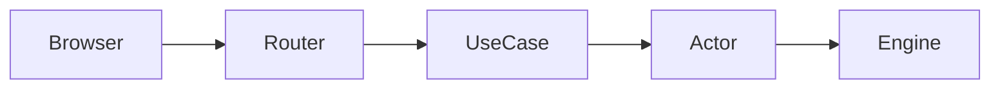

# Documentation

How every service documents itself. The goal is a repo whose README is short and
scannable, whose API contract is machine-checkable, and whose deeper guides live
in one predictable place.

## README

The README is an entry point, not a manual. Keep it short. It contains, in order:

1. Title and a one-paragraph description of what the service is.
2. **Features** — a short bullet list of capabilities.
3. **Tech stack** — the main libraries with links.
4. **Getting started** — the few commands to build, run, and test.
5. **Coding guidelines / docs** — a link to `docs/guide/` and the guidelines file.

What the README must NOT contain:

- **No API endpoint tables.** A Markdown table of methods and paths goes stale
  and is not machine-checkable. The API contract lives in an OpenAPI spec (below).
- **No architecture diagrams.** A flow, sequence, or state diagram lives once,
  in the `docs/guide/` architecture page. The README links to that page; it does
  not paste a second copy of the diagram.
- No long prose walkthroughs, environment setup steps, or architecture essays —
  those belong under `docs/guide/`.

## API contract: OpenAPI in `docs/`

Every HTTP API is described by an OpenAPI specification committed under `docs/`
(for example `docs/openapi.yaml`). It is the single source of truth for paths,
parameters, request/response schemas, and status codes.

- The spec is validated (a `make`/`mise` task or a pre-commit/pre-push hook).
- New or changed endpoints update the spec in the same change.
- The README and guides link to the spec; they do not restate it.

## Diagrams: Mermaid

All diagrams and flowcharts in Markdown use **Mermaid** fenced blocks, so they
render in GitHub and stay in version control as text:

- Do not paste ASCII-art boxes, screenshots of diagrams, or binary image exports
  when a Mermaid diagram expresses the same thing.
- Sequence, flow, and state diagrams are all Mermaid.
- Each diagram has a single home: the relevant `docs/guide/` page. Other
  documents (README included) link to that page instead of copying the diagram,
  so it is never maintained in two places.

## Guides: `docs/guide/`

Deeper documentation lives under `docs/guide/pages/{topic}/`, one folder per
topic (for example `dev-env/`, `integration-testing/`, `openapi/`). Each topic
folder holds its page plus any partials and images it needs. Common topics:

- `dev-env` — prerequisites, install, environment variables, how to run locally.
- `openapi` — how to view and validate the API spec.
- Architecture and data-flow pages using Mermaid diagrams.

Keep guides task-focused. One page answers one question a contributor has.

## Neutrality and sanitizing

Documentation is vendor-neutral: no company or product names in a public or
portfolio repository. Run any generated Markdown through `sanitizing-text` before
committing (see `sanitizing-text.md`).
