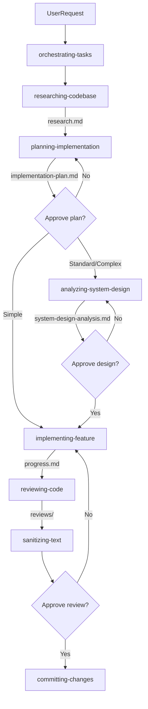

# Orchestrating Tasks

Single entry point for all AI-assisted tasks. Routes to the right skill chain, manages plan state, and checkpoints with the user. Never writes code or commits directly.

---

## ⚡ PRIORITY RULE — Parallel Agent Dispatch

**Whenever two or more sub-tasks are independent, dispatch them as background agents in parallel. Do not serialize work that can be parallelized. This supersedes all other execution preferences.**

Before each phase: identify which sub-tasks don't depend on each other's output — dispatch those in parallel; run the rest in dependency order.

```
task(agent_type: "explore"|"general-purpose", mode: "background", name: "...", prompt: "full context...")
```

- `explore` — read-only research (grep/glob/view)
- `general-purpose` — writes files, runs bash, edits code
- Prompts must be self-contained — agents are stateless
- Use `read_agent(agent_id)` after completion notification

| Scenario | Wrong | Right |
|---|---|---|
| Research 3 services | Sequential, 3 turns | 3 `explore` agents, 1 turn |
| Write `kit/logger` + `kit/apperror` | Write one, wait, write other | 2 `general-purpose` agents in parallel |
| Implement domain + repository (no dependency) | Domain then repository | Both in parallel |

> Failing to parallelize independent tasks is a performance violation.

---

## Step 1 — Setup & Plan Discovery

1. Ensure plans symlink exists — run setup from `.github/skills/references/plans-setup.md`
2. Correct legacy paths: `.github/ai/skills/` → `.github/skills/`

When no slug is provided, scan `.github/plans/` and read each `progress.md`:

| Situation | Action |
|-----------|--------|
| User provided slug | Use directly |
| 1 plan with `IN_PROGRESS` | Use automatically, inform user |
| Multiple `IN_PROGRESS` | List and ask which to use |
| None found | Offer to create new plan or reopen a `DONE` one |

## Step 2 — Read Plan Status

Read `.github/plans/{slug}/progress.md` and route:

| Status | Action |
|--------|--------|
| File absent or no `## Status` | Start from scratch — full workflow |
| `IN_PROGRESS` | Find last completed phase, resume from there — skip completed phases |
| `REVIEW` | Go directly to reviewing-code; read `implementation-plan.md` + `progress.md` |
| `DONE` | Report complete. Ask "Reopen?" — do not proceed without confirmation |

When reopening: update `## Status` to `IN_PROGRESS`, ask where to restart.

## Step 3 — Classify & Delegate

Classify complexity, then delegate to the matching skill chain. Apply the PRIORITY RULE — dispatch independent phases in parallel before proceeding.

| Level | Criteria | Skill chain |
|---|---|---|
| Simple | Single file, typo, config | implementing-feature only |
| Standard | New endpoint, bug fix (≤3 layers) | planning-implementation → **analyzing-system-design** → implementing-feature → reviewing-code |
| Complex | New domain, cross-service, migrations | All skills — analyzing-system-design is mandatory |

> `analyzing-system-design` is not optional for Standard and Complex. The Coder must not start until `system-design-analysis.md` is approved.



> Checkpoint2 approves the review only — committing-changes still requires separate explicit user authorization.

---

## Approval Checkpoints

Never bypass. Always wait for explicit approval before proceeding.

| Skill | Requires approval before |
|---|---|
| `analyzing-system-design` | Any implementation phase starts |
| `committing-changes` | Any `git commit` or `git push` |
| `creating-pull-request` | Any `gh pr create` |

## Error Recovery

- MCP tools unavailable: proceed with local context (plan files + codebase), inform user, do not block.
- Skill fails mid-execution: update `progress.md` with failure point, present options (retry / skip / abort).

---

## Output Contract

For every new task, create (slug = kebab-case description, e.g. `add-user-endpoint`):

```
.github/plans/{slug}/
├── brief.md      ← context + acceptance criteria
└── progress.md   ← ## Status: IN_PROGRESS
```

## State Management

Only `orchestrating-tasks` and the skills below may write the `## Status` line in `progress.md`.

| From | To | Who | When |
|------|----|-----|------|
| _(absent)_ | `IN_PROGRESS` | orchestrating-tasks | brief.md created |
| `IN_PROGRESS` | `REVIEW` | implementing-feature | All phases done, lint + tests pass |
| `REVIEW` | `IN_PROGRESS` | orchestrating-tasks | reviewing-code finds blockers |
| `REVIEW` | `DONE` | reviewing-code | User explicitly approves review |
| `DONE` | `IN_PROGRESS` | orchestrating-tasks | User explicitly asks to reopen |

```markdown
## Status
IN_PROGRESS

## Phase 1 — Domain Model ✅
- [x] Entity created
- [x] Tests passing

## Phase 2 — Use Case ⏳
- [x] UseCase struct
- [ ] Unit tests
```

Valid values: `IN_PROGRESS` | `REVIEW` | `DONE`

## Context Compression

Offer compression at every user-facing checkpoint when: context ≥ 70%, or session spans research + planning + coding.

```
Context is at {N}% — compress now to resume cleanly in a new chat?
Reply "yes" or /compress.
```

Skill: `.github/skills/compressing-context/SKILL.md`

---

## Common Mistakes

- **Serializing independent phases** — always check for parallelism before delegating a phase
- **Skipping `analyzing-system-design`** for Standard/Complex tasks — it is mandatory, not optional
- **Treating review approval as commit authorization** — they are separate checkpoints
- **Assuming the active plan** without reading `progress.md` — always discover first
- **Writing code directly** — this skill only routes; implementation goes to implementing-feature

## Permissions

- ✅ Invoke any skill
- ✅ Read any file
- ✅ Create and update `brief.md`, `progress.md`
- ❌ Write production code or tests
- ❌ Commit without EXPLICIT USER authorization
- ❌ Assume "proceed with implementation" covers commit authorization — it does not
- ❌ Skip any approval checkpoint

